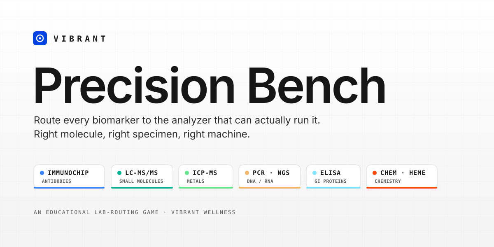

# Vibrant Labs — Precision Bench

**An educational lab-science game. You're a scientist at the Vibrant Wellness bench: read each patient report, then route every biomarker to the analyzer that can actually run it. Right molecule, right specimen, right machine.**

The twist that makes it real: a single panel rarely belongs to one instrument. A **Gut Zoomer** spans microbiome sequencing, ELISA, and mass spec. A **Total Tox Burden** needs LC-MS/MS *and* ICP-MS *and* genotyping. So you can't just shove the whole report into one machine — you read the full requisition and split it, aliquot by aliquot.

🎮 **Play:** _[Vercel URL added on deploy]_



---

## How to play

1. **Read the report.** Each patient kit lists a panel, the specimens collected, and a tray of aliquots — one per biomarker. Each aliquot shows its **molecule class** and **specimen type**.
2. **Pick up an aliquot.** Click it (or drag it). It lifts off the tray and follows your cursor.
3. **Route it to the right analyzer.** Click the machine that runs that molecule class. Drag-and-drop works too.
4. **Mind multi-method reports.** Big Zoomers span several analyzers — route each marker on its own.
5. **Protect your accuracy.** Correct routes build a combo multiplier and a turnaround bonus. Misroutes burn QC tolerance — run out and the bench goes on **QC hold**.

Shortcuts: **Esc** drops a held aliquot / closes a dialog · **P** pauses · **REF** opens the Lab Reference mid-shift (pauses the clock).

---

## The science (this is the whole game)

Every analyte belongs to a **molecule class**, and each class runs on exactly **one analyzer**. Learn the six and you've learned the game. The mappings mirror Vibrant Wellness / Vibrant America's real platforms:

| Analyzer | Methodology | Molecule class it runs | Example markers |
|---|---|---|---|
| **Immunochip Array** | Silicon-chip peptide/protein microarray + chemiluminescence (Vibrant's proprietary *3Dense*) | Antibodies (IgG/IgA/IgM/IgE) | Wheat gliadin & tTG, food peptides, neural & connective-tissue autoantibodies, tickborne antigens |
| **LC-MS/MS** | Liquid chromatography–tandem mass spec (+ GC-MS/MS) | Small organic molecules | Mycotoxins, environmental chemicals & PFAS, hormone metabolites, organic acids, fat-soluble vitamins, fatty acids |
| **ICP-MS** | Inductively coupled plasma mass spec | Metals & trace elements | Lead, mercury, arsenic, cadmium; magnesium, selenium, zinc, iodine |
| **PCR · Sequencer** | Real-time PCR + next-gen metagenomic sequencing | Nucleic acids (DNA/RNA) | Gut microbes, pathogen genes, human SNPs (MTHFR, APOE, Factor V Leiden) |
| **ELISA Reader** | Enzyme-linked immunosorbent microplate assay | Single GI/barrier proteins | Calprotectin, zonulin, secretory IgA, pancreatic elastase |
| **Chemistry · Hematology** | Automated clinical chemistry & hematology analyzers | Routine chemistries & blood counts | apoB, Lp(a), hs-CRP, lipids, glucose, HbA1c, CBC |

And the specimen matters: heavy metals come in **metal-free urine**, the microbiome comes in **stool**, diurnal cortisol comes in **saliva**, genetics come from a **buccal swab**, and most antibody panels run from **serum or a dried blood spot**.

### What you'll route

The marker set spans the breadth of the Vibrant menu — Cardio, Neural, Gut, Hormone, Cellular, Immune, Toxin, Food, Nutrient and Foundation systems — including panels that deliberately force several analyzers at once:

- **Gut Zoomer** → PCR/sequencing (microbes) + ELISA (calprotectin, sIgA, elastase) + LC-MS/MS (short-chain fatty acids)
- **Total Tox Burden** → LC-MS/MS (mycotoxins, glyphosate, PFAS) + ICP-MS (heavy metals) + genotyping (detox SNP)
- **Cardio Zoomer** → chemistry (apoB, Lp(a), hs-CRP) + LC-MS/MS (ceramides) + genotyping (APOE)
- **Tickborne 2.0** → immunochip antibodies (indirect) + PCR (direct pathogen DNA)
- **Foundation Zoomer** → a five-analyzer capstone from blood and a swab

### Shifts

| Shift | Focus |
|---|---|
| **1 · Orientation** | One analyzer per report — learn what each machine detects (hints on). |
| **2 · Mixed Panels** | Two-to-three methodologies per report; specimen type starts to matter. |
| **3 · Full Zoomers** | The big multi-method panels. Hints off. |
| **4 · Rush Hour** | Peak volume, capstone reports, tight QC. |
| **Overflow** | Endless escalating shifts — push your high score. |

---

## Tech

- Vanilla JavaScript (ES modules), HTML, and CSS. **No build step, no dependencies, no tracking.**
- WebAudio-synthesized sound effects (no audio assets).
- High score persists in `localStorage`.
- Brand system applied throughout: Reflex Blue `#0142E2`, Lab Coat White `#F3F3F3`, Ink Black `#161616`, the ten Zoomer accent colors, Inter + Roboto Mono.

### Run locally

Any static file server works (ES modules need HTTP, not `file://`):

```bash
# from the project root
python3 -m http.server 4178
# then open http://localhost:4178
```

### Deploy

Zero-config static deploy on Vercel — no framework, no build command. Push the repo and import it, or:

```bash
vercel --prod
```

---

## Disclaimer

This is an **educational game** built to teach how molecule class and specimen type determine lab methodology. Analyzer-to-marker mappings reflect Vibrant Wellness / Vibrant America's publicly described platforms, simplified for play. It is **not** a diagnostic tool, lab SOP, or medical advice. The real tests referenced are **laboratory-developed tests (LDTs)** whose performance characteristics are determined by the lab; they are not cleared or approved by the FDA.

---

*Built with the Vibrant Wellness brand system — "Clarity for providers. Confidence for patients."*
